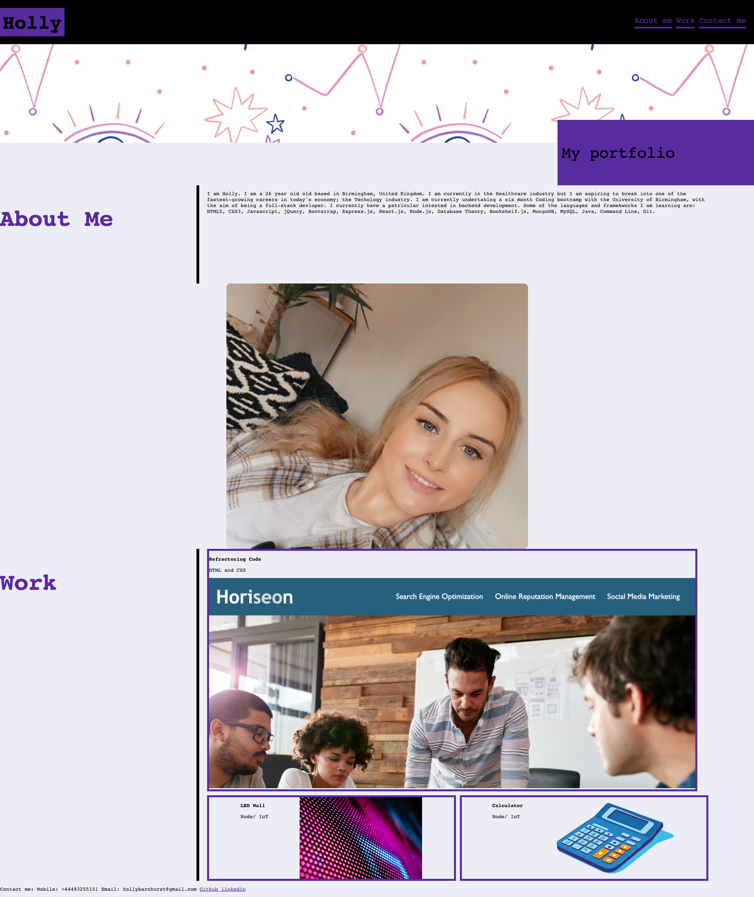

README.md
This code has produced a portfolio that future employees will be able to access. Included in this portfolio there is a: "About me" section, where there is a summary of the future employee, a "Work" section, whereby it includes a section of what the employee has produced and a "Contact me" where future employees can contact the future employee. This code was all created from scratch. 

HTML issues: 
1. There was no starter code given for this challenge.
2. In the criteria provided, it needed to have links in the navigation to link with the sections of the website
3. Criteria wanted the user to be able to enter 
4. Needed to add contact details so future employers could contact

HTML solution:
1. Started the code from scratch. Added the CSS afterwards. 
2. Added anchor tags and id tags to take the user to that certain part of the website from the navigation link
3. Encorporated the anchor tag with the image and the link so users can be redeployed to Github account so the user can access previous work
4. Added contact details in the footer and a link from the navigation bar so users can be redeployed to the contact details located in the footer. 

CSS issues:
1. Criteria was to have a picture 
2. The first application should be a larger size than the others
3. The CSS should be responsive

CSS solution:
1. Added picture in the about me section so potential employees can see
2. Created boxes within the CSS style, added one large box followed by two small onces and then added the images within the CSS
3. Made the CSS responsive by adding flex wrap and display felx tags to make the web page responsive. 

It is known that students who have effective portfolios that highlight some of the work that they have produced, that are deployed as web  applications are more likely to succeed in their tech career as it allows for employers to see what they have developed. Please refer to the printscreen below to see the website created: 

 